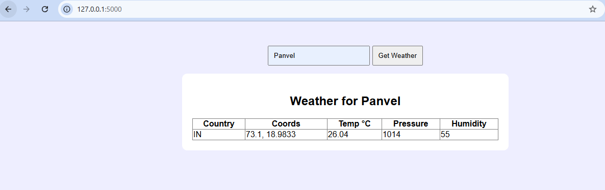
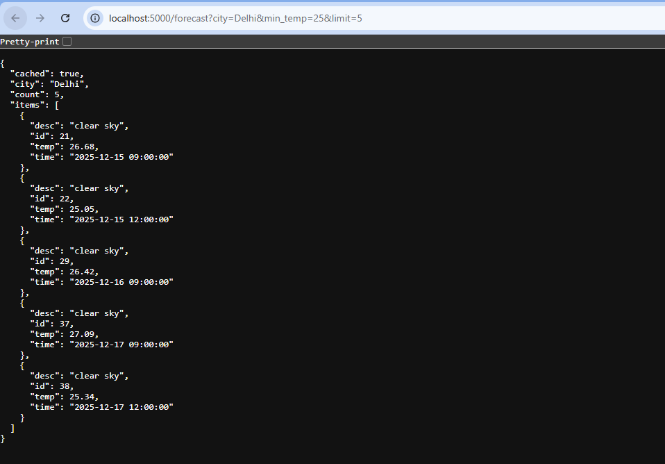
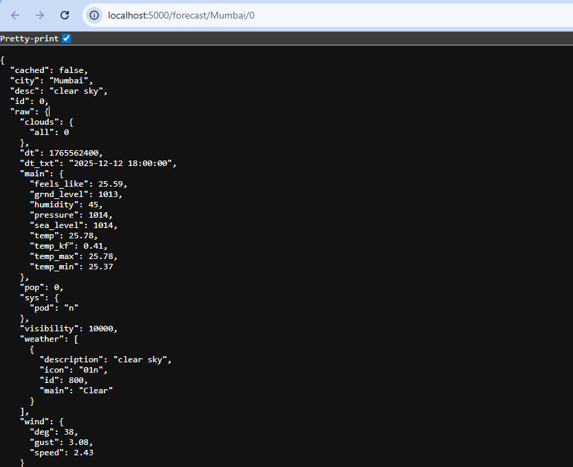

# **PROJECT DOCUMENTATION - Weather API + UI + Forecast API**

## 📌 Overview

This project is a lightweight Flask application that integrates with the **OpenWeather REST API** and demonstrates:

- Fetching data from **two different public API endpoints**
- **UI-based weather lookup** (HTML form)
- **JSON API endpoints** for listing, filtering, and detailed forecast data
- **In-memory caching** to reduce API calls
- **Error handling** for network issues, invalid responses, and malformed data

This satisfies all assignment requirements while keeping the code compact and readable.

---

## **How to Run the Project**

### **1. Install dependencies**
```bash
pip install flask requests
```

### **2. Add your OpenWeather API key**
Inside `app.py`:
```python
API_KEY = "YOUR_API_KEY"
```

### **3. Run the Flask server**
```bash
python app.py
```

### **4. Open the UI**
Visit:
```
http://localhost:5000
```



---

## **How to Use the Application**

## ✅ **1. UI - Current Weather Lookup**

### **URL**
```
http://localhost:5000
```

### **How it works**
- Enter a city name in the input box.
- Click **Get Weather**.
- The page displays:
  - Temperature (°C)
  - Country
  - Coordinates
  - Pressure
  - Humidity

### **Example**
Enter: **Panvel**  
You will see a formatted weather table.

---

# ✅ **2. API - Current Weather (JSON)**

### **Endpoint**
```
GET /weather?city=<city_name>
```

### **Optional filters**
- `min_temp` → only return if temperature ≥ min_temp  
- `max_temp` → only return if temperature ≤ max_temp  

### **Example**
```
http://localhost:5000/weather?city=London
```

### **With filters**
```
http://localhost:5000/weather?city=London&min_temp=10&max_temp=25
```

### **Sample Response**
```json
{
  "city": "London",
  "cached": false,
  "temp": 14.2,
  "country": "GB",
  "coord": { "lon": -0.13, "lat": 51.51 }
}
```

---

# ✅ **3. API - Forecast List (JSON)**

### **Endpoint**
```
GET /forecast?city=<city_name>
```

### **Optional filters**
- `min_temp`  
- `max_temp`  
- `limit` → number of forecast entries to return  

### **Example**
```
http://localhost:5000/forecast?city=Delhi
```


### **Filtered Example**
```
http://localhost:5000/forecast?city=Delhi&min_temp=25&limit=5
```



---

# ✅ **4. API - Forecast Detail (JSON)**

Each forecast entry has an `id` (index).

### **Endpoint**
```
GET /forecast/<city>/<item_id>
```

### **Example**
```
http://localhost:5000/forecast/Mumbai/0
```


---

#  **Caching Behavior**

- All API responses are cached **in memory** for **5 minutes**.
- Cache keys:
  - `weather:<city>`
  - `forecast:<city>`
- Reduces API calls and speeds up responses.

---

#  **Error Handling**

The app gracefully handles:

###  Network errors  
(e.g., no internet, DNS failure)

###  Timeout errors  
(API not responding)

###  Invalid JSON  
(OpenWeather returns malformed data)

###  Missing fields  
(Skips broken forecast entries)

###  Invalid user input  
- Missing `city`
- Invalid `item_id`

###  API errors  
(4xx / 5xx from OpenWeather)

All errors return JSON like:
```json
{ "error": "Meaningful error message" }
```

---

#  **Endpoints Summary**

| Feature | URL | Method | Output |
|--------|-----|--------|--------|
| UI Weather Page | `/` | GET/POST | HTML |
| Current Weather | `/weather?city=...` | GET | JSON |
| Forecast List | `/forecast?city=...` | GET | JSON |
| Forecast Detail | `/forecast/<city>/<id>` | GET | JSON |

---

#  *Assumptions*

- Temperature is always returned in **metric (°C)**.
- City names are simple strings (no city IDs).
- UI is only for **current weather**, not forecast.


